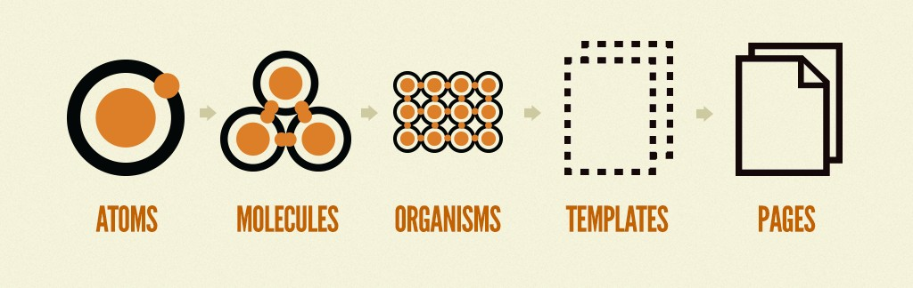

# Overview

## Introduction

**CZAN** is a design system, named in honor of [Paul Cezanne](https://en.wikipedia.org/wiki/Paul_C%C3%A9zanne), a renowned painter from Aix-en-Provence, France, the developer's hometown.

This framework is specifically adapted for apps running on [Compose Multiplatform](https://www.jetbrains.com/lp/compose-multiplatform/) and will apply a specific look & feel for the targeted platforms:

- 🤖 Android: [Material 3](https://m3.material.io/), Google's open-source design system
- 🍎 iOS: Cupertino, Apple's design system

---

## Atomic Design System

**CZAN** is following the [Atomic Design](https://bradfrost.com/blog/post/atomic-web-design/) methodology, where atoms, molecules and organisms are the different levels of design you can
use to build your app.

The **Atomic Design System** is a methodology for creating scalable, consistent, and reusable user interfaces by breaking down the UI into fundamental building blocks. It organizes components into five hierarchical levels:

1. [**Atoms**](#atoms)
   The basic building blocks, such as buttons, icons, text inputs, and colors. These are the smallest indivisible elements of a UI.

2. [**Molecules**](#molecules)
   Simple combinations of atoms that work together, such as a search input with a button.

3. [**Organisms**](#organisms)
   More complex components composed of molecules and atoms, such as a header or a product card.

4. **Templates**  
   Layouts that arrange organisms in a specific structure, providing a blueprint for pages.

5. **Pages**  
   Fully-realized templates populated with real content, forming complete screens in an application.

The atomic design system emphasizes **modularity** and **reusability**, making it easier to maintain, scale, and adapt the UI across different platforms while ensuring a consistent user experience.

#### Atoms

Atoms are the basic building blocks of the user interface. They represent the simplest, indivisible components of a design. Atoms are often used on their own, but are also combined with others to create more complex elements.

Examples:

- Text
- [Button](atoms/button.md)
- Text field
- Icon
- Chip, etc.

#### Molecules

A `Molecule` is a small, reusable component made up of individual elements (atoms) that work together as a unit. For example, a form input field that includes a text field (an atom) and a label (another atom) is considered a molecule. Molecules combine these basic building blocks to create slightly more complex UI elements that serve a specific function.

Molecules maintain simplicity but add structure and meaning by grouping related atoms.

Examples:

- CardTip
- NumericKeyboard
- Tabs, etc.

#### Organisms

An `Organism` is a larger, more complex component that combines multiple molecules and atoms into a distinct section or part of the interface. For example, a header organism could consist of a logo, navigation links, and a search bar, each of which could be individual molecules.

Organisms are often the building blocks for broader sections of an application, such as card layouts or bottom sheets. They group related content and functionality, providing structure to the interface and enhancing user navigation by creating recognizable sections of the UI.

Examples:

- Card

## Roadmap

The **CZAN** design system, still in its early stages, has an exciting journey of development ahead. Checkout the [roadmap](https://github.com/users/Tweener/projects/1/views/1) to know all about the
upcoming tasks, presented in no specific order and without set deadlines.

## Credits

- Logo by [Icons8](https://icons8.com/icon/38803/atom-editor)
